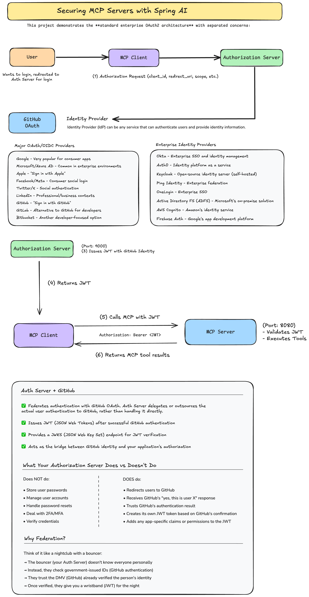
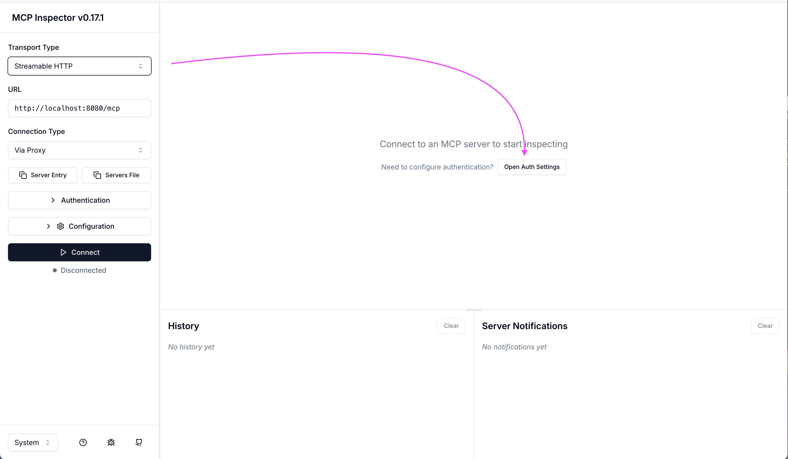
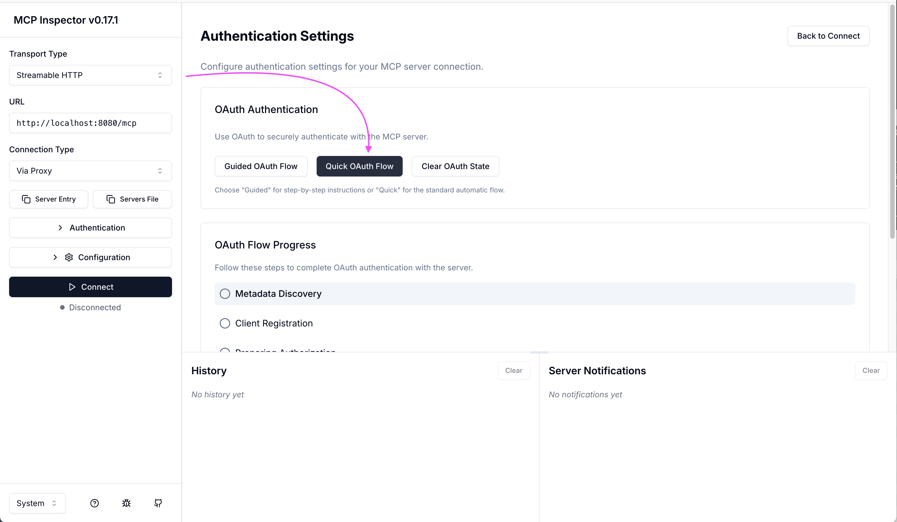
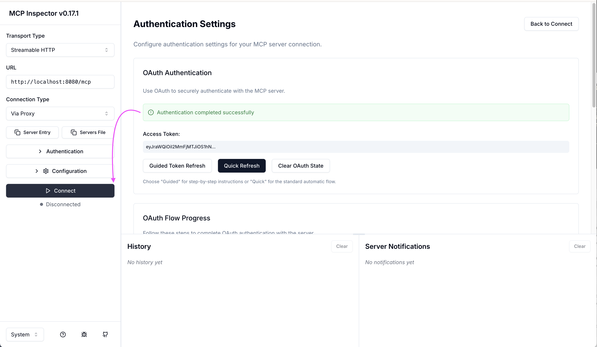

# Secured MCP Server with Spring AI

A demonstration of securing a Model Context Protocol (MCP) server using Spring Authorization Server and GitHub OAuth2. Users authenticate with GitHub, receive a JWT token, and use it to call secured MCP tools.

**Based on the article by Daniel Garnier-Moiroux:**
https://spring.io/blog/2025/09/30/spring-ai-mcp-server-security



## Architecture

```
┌─────────────┐
│   GitHub    │ (Identity Provider)
└──────┬──────┘
       │
       ▼
┌────────────────────────┐
│  Authorization Server  │ (Port 9000)
│  - GitHub OAuth Login  │
│  - Issues JWT tokens   │
└──────┬─────────────────┘
       │
       ▼
┌─────────────┐  Authorization: Bearer <JWT>   ┌──────────────┐
│ MCP Client  │──────────────────────────────► │  MCP Server  │ (Port 8080)
└─────────────┘                                │  - 2 Tools   │
                                               └──────────────┘
```

## Project Structure

```
mcps/
├── pom.xml                                   # Parent POM
├── mvnw                                      # Maven wrapper
│
├── authorization-server/                     # Port 9000
│   └── src/main/java/dev/danvega/authserver/
│       ├── AuthServerApplication.java        # Main application
│       ├── SecurityConfig.java               # OAuth2 + GitHub login
│       └── application.yml                   # Configuration
│
└── mcp-server/                               # Port 8080
    └── src/main/java/dev/danvega/mcps/
        ├── Application.java                  # Main application
        ├── McpServerSecurityConfig.java      # JWT validation
        └── McpToolsService.java              # MCP tools (echo, getCurrentUser)
```

## Quick Start

### 1. Prerequisites

- Java 21+
- Maven 3.6+
- GitHub account

### 2. Create a GitHub OAuth App

1. Go to [GitHub Developer Settings](https://github.com/settings/developers)
2. Create a **New OAuth App**:
   - **Application name**: MCP Authorization Server
   - **Homepage URL**: `http://localhost:9000`
   - **Callback URL**: `http://localhost:9000/login/oauth2/code/github`
3. Save the **Client ID** and **Client Secret**

### 3. Set Environment Variables

```bash
export GITHUB_CLIENT_ID="your-github-client-id"
export GITHUB_CLIENT_SECRET="your-github-client-secret"
```

### 4. Build and Run

```bash
# Build both modules
./mvnw clean install

# Terminal 1: Start Authorization Server (must start first!)
./mvnw spring-boot:run -pl authorization-server

# Terminal 2: Start MCP Server
./mvnw spring-boot:run -pl mcp-server
```

The authorization server runs on port 9000, MCP server on port 8080.

## Testing with MCP Inspector







The MCP Inspector tool provides an easy way to test the complete OAuth2 flow and interact with your secured MCP server.
=
## Available MCP Tools

**1. echo** - Echo back a message with timestamp
```json
{"message": "Hello"}
```

**2. getCurrentUser** - Get authenticated user information
```json
{}
```

## Key Features

### Authorization Server (Port 9000)
- GitHub OAuth2 federated login
- Issues JWT access tokens (15-minute lifetime)
- Refresh tokens (1-day lifetime)
- Standard OAuth2/OIDC endpoints

### MCP Server (Port 8080)
- JWT validation using JWKS from auth server
- Audience claim validation
- Two secured MCP tools
- Stateless architecture

### Useful Endpoints

```bash
# Authorization server metadata
curl http://localhost:9000/.well-known/oauth-authorization-server

# JWKS (public keys for JWT validation)
curl http://localhost:9000/oauth2/jwks
```

## Configuration Details

The MCP client is pre-registered with these credentials:
- **Client ID**: `mcp-server`
- **Client Secret**: `secret`
- **Scopes**: `openid`, `profile`, `email`, `mcp.server`, `mcp.tools`

Token lifetimes are configured in `authorization-server/src/main/resources/application.yml`:
- Access tokens: 15 minutes
- Refresh tokens: 1 day
- Authorization codes: 5 minutes

## Troubleshooting

**401 Unauthorized?**
- Ensure auth server is running first (port 9000)
- Check your token hasn't expired (15-minute lifetime)
- Get a fresh token if needed

**GitHub OAuth not working?**
- Verify callback URL: `http://localhost:9000/login/oauth2/code/github`
- Check `GITHUB_CLIENT_ID` and `GITHUB_CLIENT_SECRET` are set

## References

- [Spring AI MCP Server Security Article](https://spring.io/blog/2025/09/30/spring-ai-mcp-server-security)
- [Spring Authorization Server Docs](https://docs.spring.io/spring-authorization-server/reference/)
- [Model Context Protocol Specification](https://modelcontextprotocol.io/specification)
